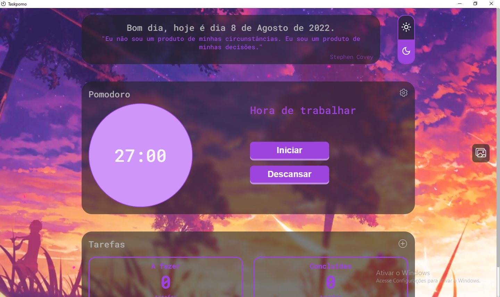
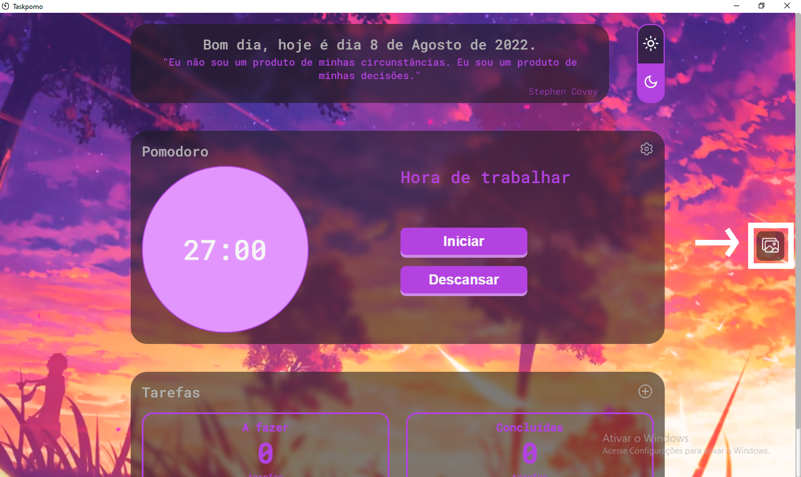

# Taskpomo (desktop)

## Imagem do projeto

## Tecnologias utilizadas
- ReactJS
- TypeScript
- Styled Components
- Electron

## Funcionalidades
- ### Lista de tarefas
    Ele possui uma lista de tarefas, nessa lista você pode adicionar, remover tarefas, conclui-lás, filtrar pelas completas ou a fazer, além disso as tarefas tem uma propriedade chamada prioridade, nela é possivel definir a prioridade da tarefa, sejá ela alta, média ou baixa.
- ### Pomodoro
    Outra funcionalidade é o pomodoro, nele é possivel definir um tempo para trabalhar e um tempo para descansar, quando o tempo acaba e você está em outra pagina do navegador, ou em outro programa no computador, você será notificado que o tempo de trabalho ou descanso acabou.
- ### Mensagem motivacional
    Ele também possui um sistema de frases motivacionais, sempre que o app for reiniciado uma frase do arquivo "dailyMessages.json" vai ser escolhida e mostrada na tela.
- ### Tema
    O projeto também possui um sistema de temas claro e escuro, que pode ser mudado pressionando um botão que fica no canto superior direito no computador e na parte inferior em celulares.
- ### Plano de fundo personalizável
    Aqui temos uma diferença da versão desktop se comparada com a versão web, na versão desktop é possível personalizar o plano de fundo, sejá uma imagem ou um video, a unica condição é que o arquivo tenha no maximo 20MB. Para personalizar o plano de fundo é so clicar no icone de imagem que fica no centro do lado direito.
    

## Download do app
Para baixar o app e usar ele no seu computador, você pode baixar ele através do link abaixo👇​👇.  
Arquivos do app no Google drive (Windows): https://drive.google.com/file/d/14fbAfvqqV2tsd6fcjR5473PXPSzODAJL/view?usp=sharing

## Versão web
Caso queira, também é possivel acessar a versão web do app. O link do site e do repositiorio estão logo abaixo.  
Site ao vivo: https://taskpomo.netlify.app  
Repositório: https://github.com/mayron1806/pomo-task